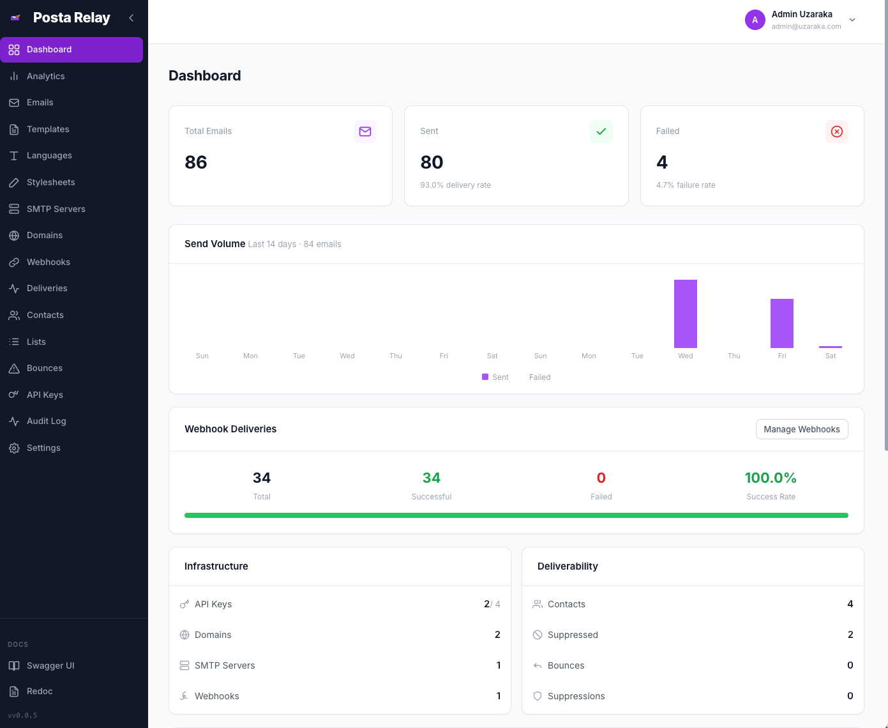
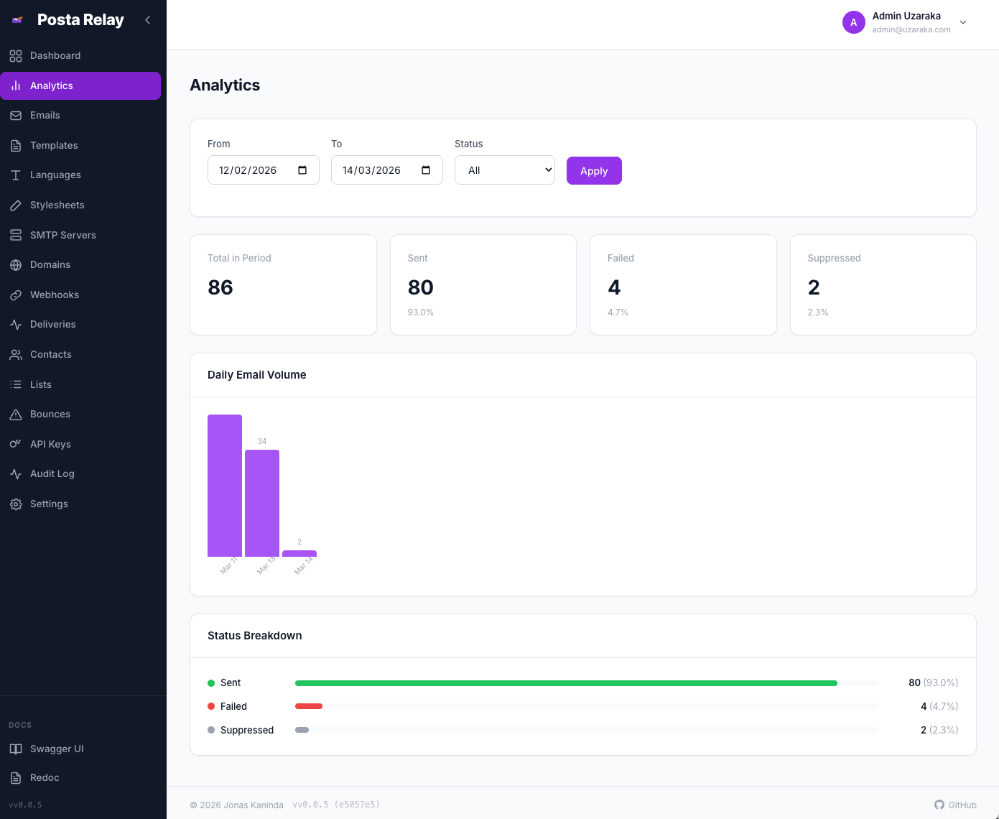
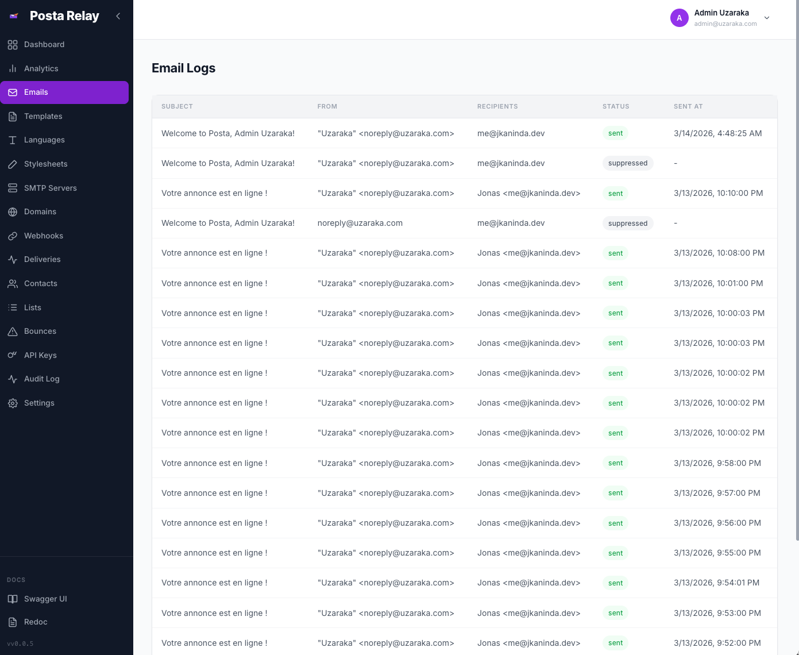
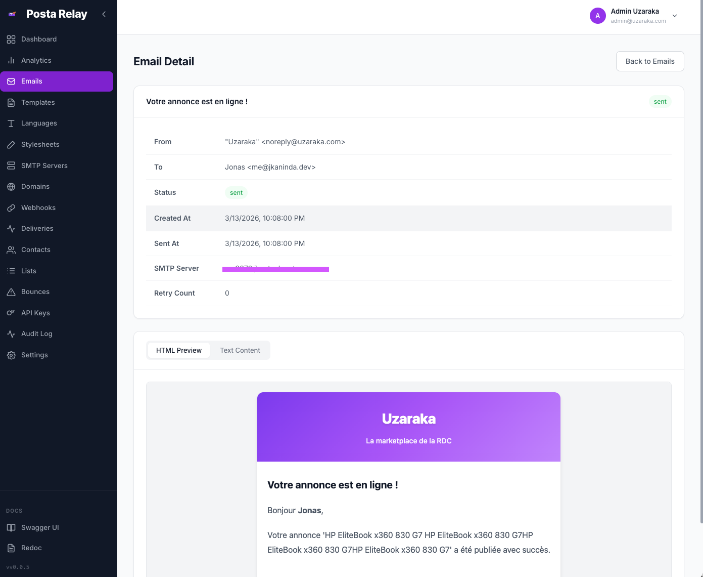
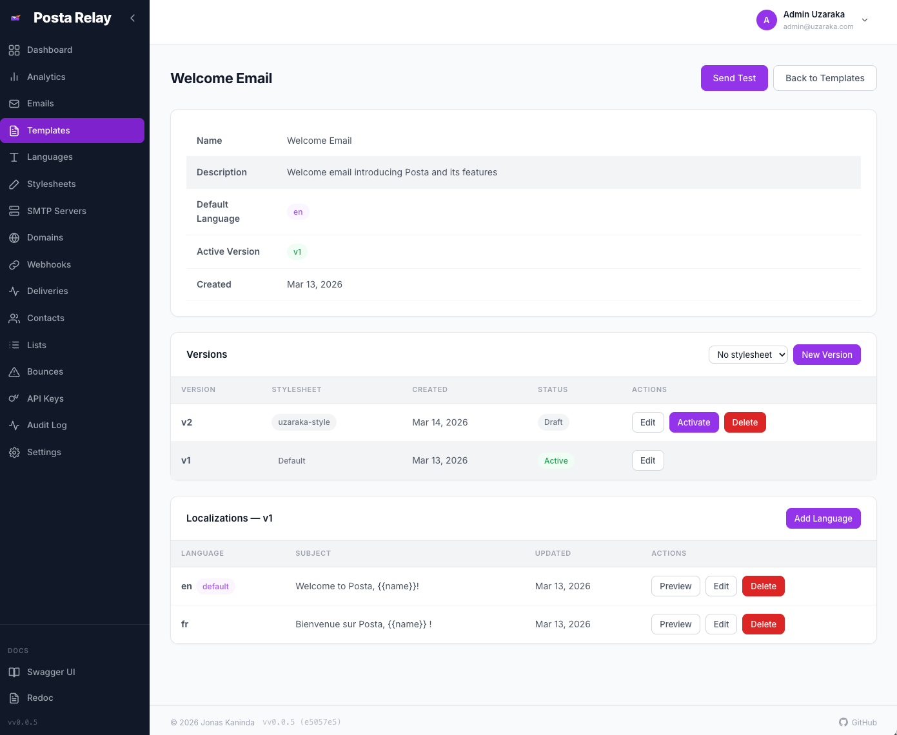
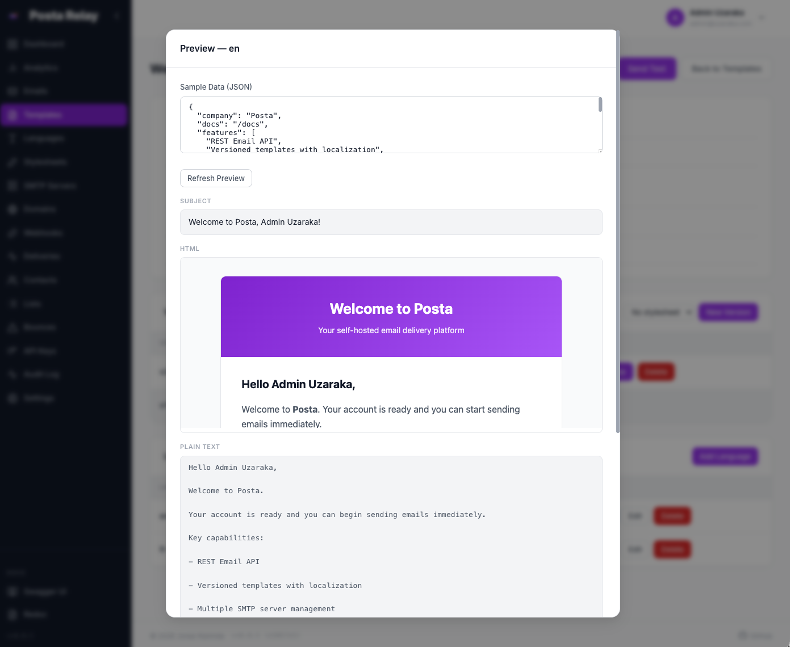
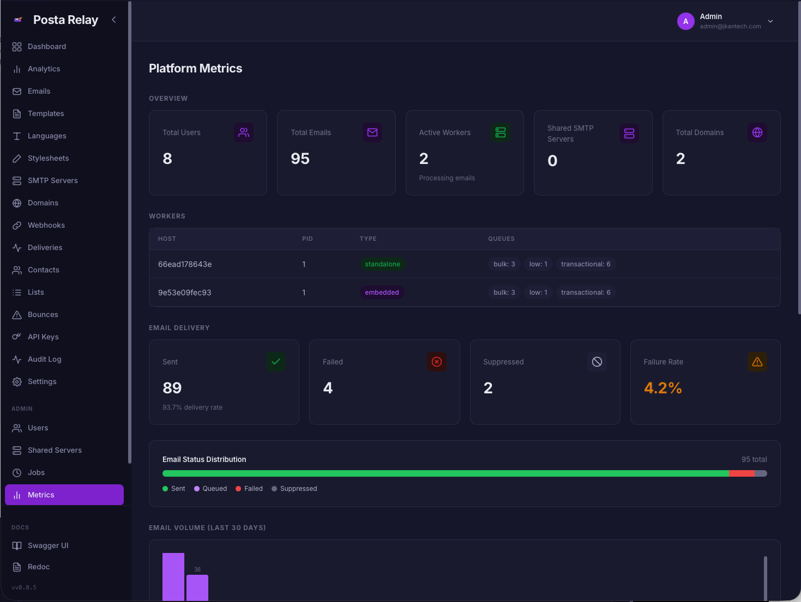
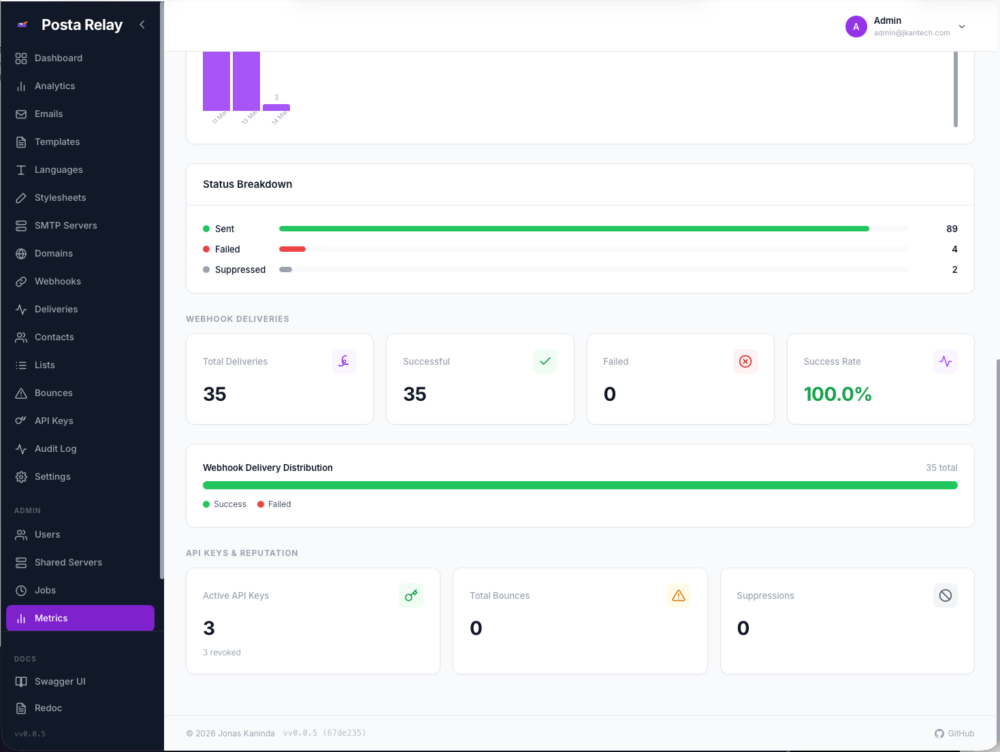
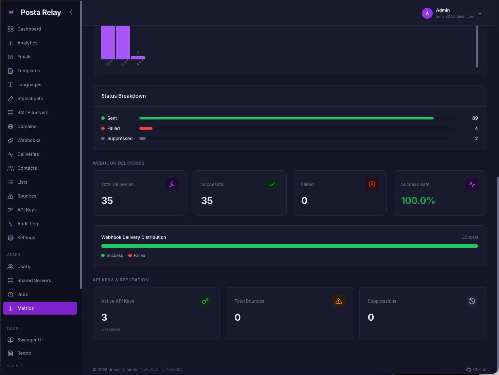

# Posta

<p align="center">
  
</p>

[](https://github.com/jkaninda/posta/actions/workflows/ci.yml)
[](https://goreportcard.com/report/github.com/jkaninda/posta)
[](https://go.dev/)
[](https://pkg.go.dev/github.com/jkaninda/posta)
[](https://github.com/jkaninda/posta/releases)


**Posta** is a self-hosted email delivery platform that allows applications to send emails through HTTP APIs while Posta manages SMTP delivery, templates, storage, security, and analytics.

It provides a developer-friendly and fully self-hostable alternative to services such as SendGrid, and Mailgun.

---

# Why Posta

Posta provides a complete email delivery platform that you can run in your own infrastructure.

* HTTP API for sending emails
* Template engine with versioning and localization
* Background job processing with Redis and Asynq
* Multiple SMTP servers and shared SMTP pools
* Domain verification with SPF, DKIM, and DMARC checks
* Contact management and bounce suppression
* Webhooks and event streaming
* Prometheus metrics and health probes
* Admin dashboard and API documentation

Posta is designed for developers who want full control over their email infrastructure without relying on third-party services.

---

# Send Your First Email

Example request:

```bash
curl -X POST http://localhost:9000/api/v1/emails/send \
  -H "Authorization: Bearer YOUR_API_KEY" \
  -H "Content-Type: application/json" \
  -d '{
    "from": "hello@example.com",
    "to": ["user@example.com"],
    "subject": "Hello from Posta",
    "html": "<h1>Hello!</h1>"
  }'
```

Response:

```json
{
  "id": "email_01J8C8E5W3",
  "status": "queued"
}
```

---

# Features

## Email Delivery

* **HTTP Email API**
  Send single, batch, or template-based emails via REST endpoints.

* **Scheduled Delivery**
  Queue emails for delivery at a specified time.

* **Asynchronous Processing**
  Background workers process email queues using Redis and Asynq with priority tiers (transactional, bulk, and low-priority).

* **Automatic Retry**
  Failed emails are retried automatically with configurable retry limits per SMTP server.

* **Development Mode**
  Store and preview emails in the dashboard without sending them.

---

## Templates

* **Versioned Templates**
  Create multiple template versions with a selectable active version.

* **Multi-language Support**
  Templates support language-specific versions with variable substitution.

* **Managed Stylesheets**
  Stylesheets are automatically inlined for email client compatibility.

* **Template Preview**
  Render and preview templates directly from the dashboard.

* **Template Import / Export**
  Export templates as JSON and import them across environments.

---

## SMTP and Domain Management

* **Multiple SMTP Servers**
  Configure multiple SMTP servers per user with SSL or STARTTLS support.

* **Shared SMTP Pool**
  Administrators can define shared SMTP servers available to all users.

* **Domain Verification**
  Verify domain ownership via DNS records including SPF, DKIM, and DMARC.

* **Verified Sending Enforcement**
  Optionally restrict sending to verified domains only.

---

## Security and Authentication

* **API Key Authentication**
  Secure API keys with hashing, prefix identification, expiration, IP allowlisting, and revocation.

* **Dashboard Authentication**
  JWT-based authentication with role-based access control.

* **Two-Factor Authentication**
  TOTP-based 2FA setup and verification.

* **Rate Limiting**
  Redis-backed hourly and daily email limits per user.

---

## Contacts and Suppression

* **Contact Management**
  Automatically track recipients with send and failure statistics.

* **Contact Lists**
  Organize recipients into reusable mailing lists.

* **Bounce Tracking**
  Track hard bounces, soft bounces, and complaints.

* **Automatic Suppression**
  Automatically suppress recipients based on bounce behavior.

---

## Events and Webhooks

* **Webhooks**
  Subscribe to events such as `email.sent` and `email.failed`.

* **Audit Logs**
  Track platform and user activity with filtering and real-time streaming using Server-Sent Events.

---

## Analytics and Monitoring

* **Email Analytics**
  View daily email volume and status breakdown with date filtering.

* **Dashboard Statistics**
  Overview of delivery metrics and recent activity.

* **Prometheus Metrics**
  Export metrics including request counts, latencies, and email delivery counters.

* **Health Probes**
  Liveness (`/healthz`) and readiness (`/readyz`) endpoints.

---

## Admin Panel

* **User Management**
  Create, deactivate, and manage users and roles.

* **Platform Metrics**
  Aggregate statistics across the entire platform.

* **Shared SMTP Servers**
  Manage SMTP servers available to all users.

* **Platform Email Logs**
  View and search emails across all users.

* **Job Monitoring**
  Track scheduled cron jobs such as retention cleanup and reports.

* **Platform Settings**
  Configure registration, retention policies, and bounce handling.

* **Real-time Event Streaming**
  Live audit log updates via Server-Sent Events.

---

## Dashboard

* **Vue.js Web Interface**
  Manage templates, SMTP servers, domains, API keys, contacts, webhooks, and email logs.

* **User Settings**
  Configure timezone, default sender, notification preferences, API key expiration, bounce handling, and daily reports.

---

## API Documentation

* **Swagger UI** — `/docs`
* **ReDoc** — `/redoc`

---

# Requirements

* Go 1.25+
* PostgreSQL
* Redis

---

# Quick Start

## Local Development

```bash
git clone https://github.com/jkaninda/posta.git
cd posta

make dev-deps
make dev
make dev-worker
```

---

## Docker Compose

```bash
docker compose up -d
```

This starts:

* Posta API server
* Background worker
* PostgreSQL
* Redis

Dashboard:

```
http://localhost:9000
```

Default admin credentials:

```
Email: admin@example.com
Password: admin1234
```

---

# Configuration

Configuration is provided through environment variables.

| Variable                   | Default                 | Description                          |
| -------------------------- | ----------------------- | ------------------------------------ |
| POSTA_PORT                 | 9000                    | HTTP server port                     |
| POSTA_DB_HOST              | localhost               | PostgreSQL host                      |
| POSTA_DB_USER              | posta                   | PostgreSQL user                      |
| POSTA_DB_PASSWORD          | posta                   | PostgreSQL password                  |
| POSTA_DB_NAME              | posta                   | PostgreSQL database name             |
| POSTA_DB_PORT              | 5432                    | PostgreSQL port                      |
| POSTA_DB_SSL_MODE          | disable                 | PostgreSQL SSL mode                  |
| POSTA_DB_URL               |                         | PostgreSQL connection string (overrides individual DB settings) |
| POSTA_REDIS_ADDR           | localhost:6379          | Redis address                        |
| POSTA_REDIS_PASSWORD       |                         | Redis password                       |
| POSTA_JWT_SECRET           | change-me-in-production | JWT signing secret                   |
| POSTA_DEV_MODE             | false                   | Store emails without sending         |
| POSTA_RATE_LIMIT_HOURLY    | 100                     | Hourly email limit per user          |
| POSTA_RATE_LIMIT_DAILY     | 1000                    | Daily email limit per user           |
| POSTA_ADMIN_EMAIL          | admin@example.com       | Default admin email                  |
| POSTA_ADMIN_PASSWORD       | admin1234               | Default admin password               |
| POSTA_OPENAPI_DOCS         | true                    | Enable Swagger UI and ReDoc          |
| POSTA_METRICS_ENABLED      | false                   | Enable Prometheus metrics            |
| POSTA_WEB_DIR              | web/dist                | Vue build directory                  |
| POSTA_WEB_URL              |                         | Public URL                           |
| POSTA_CORS_ORIGINS         | *                       | Allowed CORS origins (comma-separated) |
| POSTA_EMBEDDED_WORKER      | false                   | Run worker in server process         |
| POSTA_WORKER_CONCURRENCY   | 10                      | Worker concurrency                   |
| POSTA_WORKER_MAX_RETRIES   | 5                       | Email retry attempts                 |
| POSTA_WEBHOOK_MAX_RETRIES  | 3                       | Webhook delivery retry attempts      |
| POSTA_WEBHOOK_TIMEOUT_SECS | 10                      | Webhook request timeout in seconds   |

---
# Dashboard

Posta includes a web dashboard for managing templates, SMTP servers, domains, contacts, API keys, and analytics.

<p align="center">
  
</p>

### Email Analytics

<p align="center">
  
</p>

### Email Logs

<p align="center">
  
</p>

### Email Detail

<p align="center">
  
</p>

### Template Detail

<p align="center">
  
</p>

### Template Preview

<p align="center">
  
</p>

### Admin Platform Metrics

<p align="center">
  
</p>

### Admin Metrics (Light)

<p align="center">
  
</p>

### Admin Metrics (Dark)

<p align="center">
  
</p>

---
## Official Clients

- Go: https://github.com/jkaninda/posta-go
- Php: https://github.com/jkaninda/posta-php
- Java: https://github.com/jkaninda/posta-java

### Go Client SDK

An official Go client is available:


Install:

```bash
go get github.com/jkaninda/posta-go
```

Example:

```go
package main

import (
    "fmt"
    "log"

    posta "github.com/jkaninda/posta-go"
)

func main() {
    client := posta.New("https://posta.example.com", "your-api-key")

    resp, err := client.SendEmail(&posta.SendEmailRequest{
        From:    "sender@example.com",
        To:      []string{"recipient@example.com"},
        Subject: "Hello from Posta",
        HTML:    "<h1>Hello!</h1>",
    })

    if err != nil {
        log.Fatal(err)
    }

    fmt.Printf("Email sent: id=%s status=%s\n", resp.ID, resp.Status)
}
```

---

## Contributing

Contributions are welcome! Please open an issue to discuss proposed changes before submitting a pull request.

## License

This project is licensed under the MIT License. See [LICENSE](LICENSE) for details.

---

<div align="center">

**Made with ❤️ for the developer community**

⭐ **Star us on GitHub** — it motivates us to keep improving!

Copyright © 2026 Jonas Kaninda

</div>